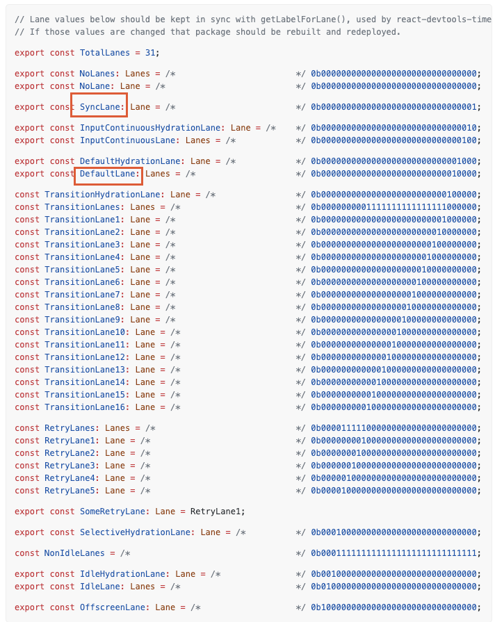

---
nav:
  title: RIE
  path: /rie
  order: 0
---

## React Internals Explorer

https://jser.dev/2024-05-11-introducing-rie/

https://jser.pro/ddir/rie?reactVersion=18.3.1&snippetKey=hq8jm2ylzb9u8eh468

说明: https://jser.dev/series/react-source-code-walkthrough  

> React Internals Explorer - easily see how React works

Fiber 是 React 16 之后提出的架构，优势主要体现在以下三部分：

- 异步可中断渲染
- 优先级调度（Lane）
- 双缓存机制（workInProgress tree, current tree)

### 异步可中断渲染
由于长时间的计算任务可能会占用线程导致页面卡顿的问题，React推出了时间切片的技术。  
> 将VDOM的执行过程，拆分为一个一个的独立的宏任务，将每个宏任务的执行时间限制在一定的范围内（5ms）  

### 优先级调度

而Scheduler调度器实现了一套基于Lane模型的优先级算法，Lane是为了标记更新的优先级，我们也可以说标记一项工作的优先级。

1. SyncLane (同步优先级)
描述：表示最高优先级的更新，立即执行，不会被打断。适用于需要快速响应用户交互的场景。
使用场景：例如，用户的点击事件、输入变化等。由于是同步的，React 会在所有其他更新之前处理这些任务。
2. DefaultLane (默认优先级)
描述：用于处理普通优先级的更新，优先级低于同步优先级，但仍然重要。
使用场景：一般的状态更新、数据加载等，这类更新会在同步更新之后进行。

lanes：表示当前 Fiber 节点的更新优先级集合，指示需要处理的更新。

childLanes: 表示与当前 Fiber 节点的子节点相关的更新优先级集合，用于管理和调度子组件的更新。

### 双缓存机制
> Fiber架构的工作原理类似于显卡的工作原理。绘制的最终产物是一张图片，这张图片被发送给显卡后即可显示在屏幕上。
  
Fiber架构中同时存在两棵Fiber Tree，一棵是真实UI对应的Fiber Tree，可理解为前缓存区。另一棵正在内存中构建的Fiber Tree，可理解为后缓存区。  
确保页面不会在渲染过程中显示不完整的内容。
  
`fiberRootNode`负责管理Current Fiber Tree和Wip Fiber tree之间的切换。

