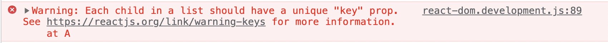

---
nav:
  title: 问题
  path: /intro
  order: 3
---
# 💓React Key

## React Key使用

key属性再列表渲染的时候起到关键作用

开发时我们偶尔会出现一个报错，显然是因为我们没有给列表项添加key值

<code src="./Code.tsx">列表</code>

常见的无效Key的情况：

- 使用数组索引
    
    如果列表的顺序变化（如排序、插入、删除等），索引 `key` 会导致 React 认为元素发生了变化，即使实际上没有变化。这会导致不必要的重新渲染、组件状态丢失、以及潜在的动画或输入框焦点等问题。
    
- 使用唯一不变key
    
    多个元素的key相同，React无法识别唯一标志，导致diff算法失效，渲染出错
    
- 缺少key
    
    没有 `key` 属性时，React 无法高效地计算和匹配变化的列表项，导致潜在的性能问题和不正确的渲染行为。

## React Key原理

React给列表加key属性的原因，和我们熟悉的diff算法有关。  

React需要同时维护两棵虚拟DOM树：一棵表示当前的DOM结构，另一棵在React状态变更将要重新渲染时生成。React通过比较这两棵树的差异，决定是否需要修改DOM结构，以及如何修改。这种算法称作Diff算法。
- tree diff
- component diff
- element diff

1）key的作用

当同一层级的某个节点添加了对于其他同级节点唯一的key属性，当它在当前层级的位置发生了变化后。react diff算法通过新旧节点比较后，如果发现了key值相同的新旧节点，就会执行移动操作（然后依然按原策略深入节点内部的差异对比更新），而不会执行原策略的删除旧节点，创建新节点的操作。这无疑大大提高了React性能和渲染效率

（2）key的具体执行过程

首先，对新集合中的节点进行循环遍历 for (name in nextChildren)，通过唯一的 key 判断新旧集合中是否存在相同的节点 if (prevChild === nextChild)，如果存在相同节点，则进行移动操作，但在移动前需要将当前节点在旧集合中的位置与 lastIndex 进行比较 if (child._mountIndex < lastIndex)，否则不执行该操作。

更多详细的源码分析：https://jser.dev/react/2022/02/08/the-diffing-algorithm-for-array-in-react